# 🧪 Laboratorio 05: Conectividad entre Sitios en Azure


## Índice

1. [Descripción](#descripción)
2. [Escenario del laboratorio](#escenario-del-laboratorio)
3. [Esquema Visual del Laboratorio](#esquema-visual-del-laboratorio)
4. [Habilidades adquiridas](#habilidades-adquiridas)
5. [Resultados esperados](#resultados-esperados)
6. [Costo Total del Laboratorio](#costo-total-del-laboratorio)
7. [Desarrollo del laboratorio](#desarrollo-del-laboratorio)
    - [Tarea 1: Crear una máquina virtual y red virtual de servicios centrales](#tarea-1-crear-una-máquina-virtual-y-red-virtual-de-servicios-centrales)
    - [Tarea 2: Crear una máquina virtual en una red virtual diferente](#tarea2-crear-una-máquina-virtual-en-una-red-virtual-diferente)
    - [Tarea 3: Usar Network Watcher para probar la conexión entre máquinas virtuales](#tarea3-usar-network-watcher-para-probar-la-conexión-entre-máquinas-virtuales)
    - [Tarea 4: Configurar peering entre redes virtuales](#tarea4-configurar-peering-entre-redes-virtuales)
    - [Tarea 5: Usar Azure PowerShell para probar la conexión entre máquinas virtuales](#tarea5-usar-azure-powershell-para-probar-la-conexión-entre-máquinas-virtuales)
    - [Tarea 6: Crear una ruta personalizada](#tarea6-crear-una-ruta-personalizada)
8. [Resultado final](#resultado-final)
9. [Puntos Clave](#puntos-clave)
10. [Eliminación de Recursos](#eliminación-de-recursos)
    - [Azure Portal](#azure-portal)
    - [Azure PowerShell](#azure-powershell)
    - [Azure CLI](#azure-cli)
11. [Contribuciones](#contribuciones)
12. [Licencia](#licencia)

---

## Descripción

Este laboratorio corresponde al módulo **AZ-104 Microsoft Azure Administrator**, específicamente el **Lab 05 - Implement Intersite Connectivity**.  
Los laboratorios oficiales se encuentran disponibles en [Microsoft Learning Labs AZ-104](https://microsoftlearning.github.io/AZ-104-MicrosoftAzureAdministrator/).  

El objetivo es practicar la **implementación de la conectividad entre redes virtuales en Azure**, explorando conceptos fundamentales de **Virtual Network Peering**, comunicación entre sitios y configuración de rutas personalizadas. A lo largo del laboratorio se trabajarán diferentes métodos de despliegue y validación: portal, plantillas ARM, y el uso de herramientas como **Network Watcher** y **Test-NetConnection** para comprobar la conectividad.  

En este laboratorio se refuerzan los principios de diseño de redes distribuidas en la nube, destacando la importancia de **evitar solapamiento de direcciones IP** y de establecer reglas claras de enrutamiento para garantizar escalabilidad y simplificar la resolución de problemas. Se introduce la creación de **peering local y global**, lo que permite conectar redes virtuales dentro de la misma región y entre regiones distintas, simulando escenarios empresariales híbridos y multinube.  

Además, se explora la configuración de **tablas de enrutamiento personalizadas**, mostrando cómo dirigir tráfico específico entre segmentos de red y aplicar reglas de acceso granular. Este enfoque es esencial en escenarios corporativos donde la seguridad, el aislamiento de cargas de trabajo y la eficiencia del tráfico son prioritarios.  

El laboratorio también aborda la validación de la comunicación entre máquinas virtuales en diferentes VNets, utilizando herramientas nativas de Azure para diagnosticar y confirmar la conectividad. Esta práctica refleja cómo las organizaciones gestionan tanto la **exposición externa de servicios** como la **comunicación interna segura** entre sitios distribuidos.  

> 💡 **Nota profesional:**  
>
> Este laboratorio no solo enseña a conectar redes virtuales, sino que también introduce buenas prácticas de diseño y seguridad en entornos distribuidos. Al combinar portal, plantillas ARM, peering local y global, rutas personalizadas y herramientas de diagnóstico, se establece un marco sólido de administración que complementa otras prácticas de gobernanza, preparando el terreno para escenarios avanzados de administración y cumplimiento normativo en Azure.

---

## Escenario del laboratorio

Nuestra organización segmenta las aplicaciones y servicios de TI centrales (como DNS y servicios de seguridad) de otras partes del negocio, incluyendo el departamento de manufactura. Sin embargo, en algunos escenarios, las aplicaciones y servicios del área central necesitan comunicarse con las aplicaciones y servicios del área de manufactura. En este laboratorio, configuramos la conectividad entre las áreas segmentadas. Este es un escenario común para separar producción de desarrollo o para separar una filial de otra.

La organización cuenta con tres redes virtuales:

- Dos en la misma región (ejemplo: East US).
- Una tercera en otra región (ejemplo: West US).  

Cada red virtual aloja máquinas virtuales que representan aplicaciones y servicios distintos. El reto consiste en habilitar la comunicación entre ellas mediante peering, asegurando que el tráfico fluya de manera segura y eficiente.

---

## Esquema Visual del Laboratorio


- **Tarea 1: Crear una máquina virtual en una red virtual.**
- **Tarea 2: Crear una máquina virtual en una red virtual diferente.**
- **Tarea 3: Usar Network Watcher para probar la conexión entre máquinas virtuales.**
- **Tarea 4: Configurar peering entre diferentes redes virtuales.**
- **Tarea 5: Usar Azure PowerShell para probar la conexión entre máquinas virtuales.**
- **Tarea 6: Crear una ruta personalizada**

---

## Habilidades adquiridas

- Implementación de *Virtual Network Peering* local y global.  
- Validación de conectividad entre máquinas virtuales en distintas redes.  
- Configuración de rutas personalizadas en Azure.  
- Uso de herramientas como *Network Watcher* y *Test-NetConnection*.  

---

## Resultados esperados

- Redes virtuales interconectadas mediante peering.  
- Comunicación validada entre máquinas virtuales de diferentes VNets.  
- Rutas personalizadas aplicadas y probadas.  
- Entorno listo para escenarios híbridos y multinube.  

---

## Costo Total del Laboratorio

Los siguientes valores se basan en la **calculadora de precios de Azure** y en las estimaciones mostradas al momento de crear las máquinas virtuales en la región **East US**. Incluyen tanto el uso de las VMs como discos, redes y licencias de Windows Server.

### Desglose de costos mensuales

| Recurso                        | Cantidad | Precio unitario (USD/mes) | Total (USD/mes) |
|--------------------------------|----------|---------------------------|-----------------|
| VM Standard_D2s_v3 (Básico)    | 2        | 137.24                    | 274.48          |
| Discos administrados           | 2        | 19.71                     | 39.42           |
| Redes (VNets + Peering)        | 2 VNets  | 3.65                      | 7.30            |
| Licencias Windows Server       | 2        | ~20.00                    | 40.00           |
| Administración                 | -        | 0.00                      | 0.00            |
| Supervisión (Network Watcher)  | -        | 0.00                      | 0.00            |
| Opciones avanzadas             | -        | 0.00                      | 0.00            |

**Costo mensual estimado total:** **USD 361.20**  
**Costo por hora (30 días × 24 h = 720 h):**

361.20 ÷ 720 ≈ **USD 0.50/h**

---

### Visualización de costos

A continuación se muestra un gráfico de barras con el desglose de costos por recurso:


---

### Notas importantes

- Los costos reales pueden variar según el tiempo que las VMs permanezcan encendidas.  
- Si se apagan las VMs al terminar cada práctica, el costo se reduce sustancialmente.  
- El peering solo genera cargos si hay tráfico significativo entre VNets.  
- Los valores de licencias de Windows Server son aproximados y dependen de la suscripción y contrato vigente.  
- Este cálculo está pensado para un **laboratorio de práctica** y no refleja un entorno productivo con cargas reales.

---

## Desarrollo del laboratorio

Aquí tienes la **traducción completa al español** de la *Tarea 1* del Lab 05, adaptada al estilo que venimos usando en tus otros laboratorios (tono inclusivo, claro y profesional):  

---

### Tarea 1: Crear una máquina virtual y red virtual de servicios centrales

En esta tarea, **creamos una red virtual de servicios centrales junto con una máquina virtual**.

1. Iniciamos sesión en el [Azure Portal](https://portal.azure.com).  
2. Buscamos y seleccionamos **Máquinas virtuales**.
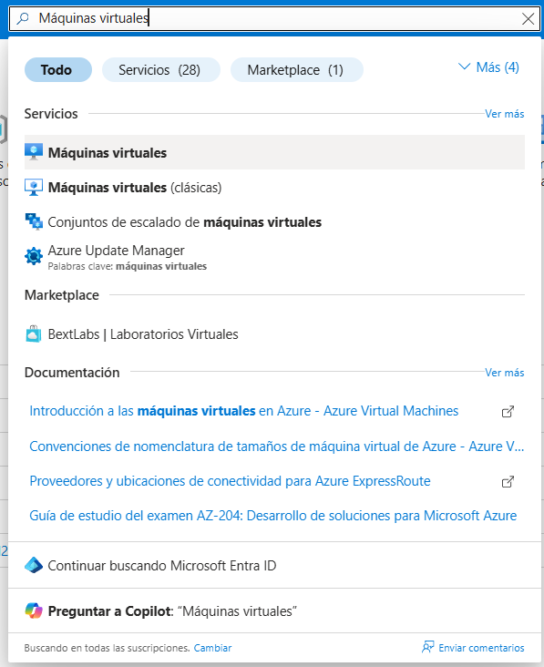
3. En la página de máquinas virtuales, seleccionamos **Crear** y luego **Máquina virtual**.
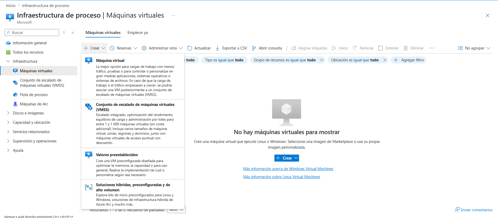
4. En la pestaña **Basics**, completamos el formulario con la siguiente información y luego seleccionamos **Siguiente: Discos >**.  
   Para cualquier configuración no especificada, dejamos el valor predeterminado.  

| Configuración | Valor |
|----------------|--------|
| Suscripción | Nuestra suscripción |
| Grupo de recursos | **az104-rg5** (Si es necesario, seleccionamos *Crear nuevo*) |
| Nombre de la VM | **CoreServicesVM** |
| Región | **(US) East US** |
| Opciones de disponibilidad | **No infrastructure redundancy required** |
| Tipo de seguridad | **Standard** |
| Imágen | **Windows Server 2025 Datacenter - x64 Gen2** (podemos observar otras opciones disponibles) |
| Tamaño | **Standard_D2s_v3** |
| Usuario | **localadmin** |
| Contraseña | Proporcionamos una contraseña compleja |
| Reglas de puertos de entrada | **Ninguno** |

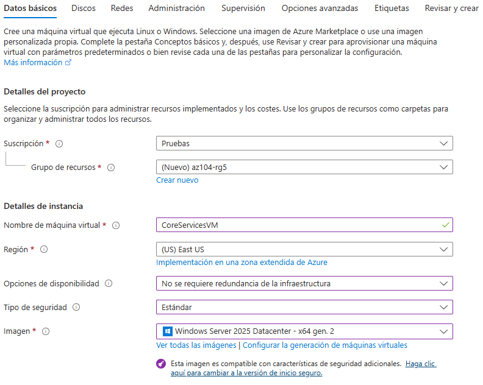
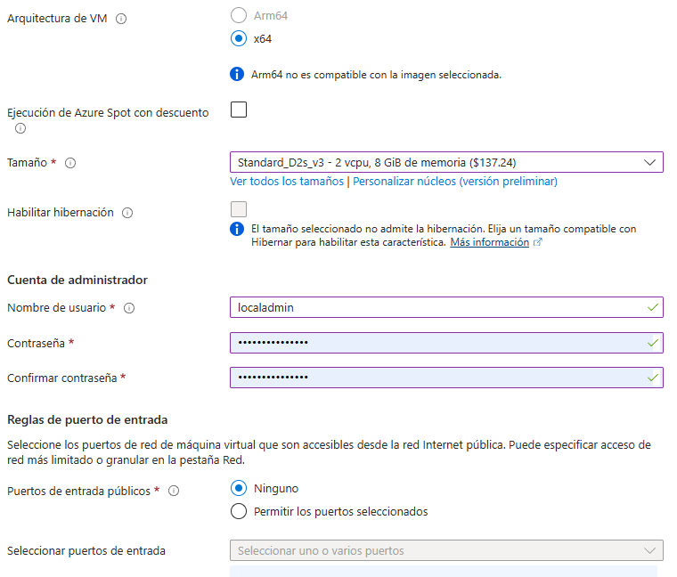

1. En la pestaña **Discos**, dejamos los valores predeterminados y seleccionamos **Siguiente: Redes >**.  
2. En la pestaña **Redes**, para **Red Virtual**, seleccionamos **Crear nuevo**.

3. Configuramos la red virtual con la siguiente información y luego seleccionamos **OK**.  
   Si es necesario, reemplazamos la información existente.  

| Configuración | Valor |
|----------------|--------|
| Name | **CoreServicesVnet** (Crear o editar) |
| Address range | **10.0.0.0/16** |
| Subnet Name | **Core** |
| Subnet address range | **10.0.0.0/24** |

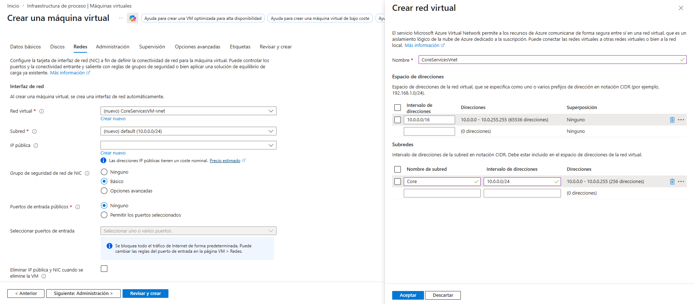

1. Seleccionamos la pestaña **Supervisión**. En **Diagnósticos de arranque**, elegimos **Deshabilitado**.  
2. Seleccionamos **Revisar y crear**, y luego **Crear**.
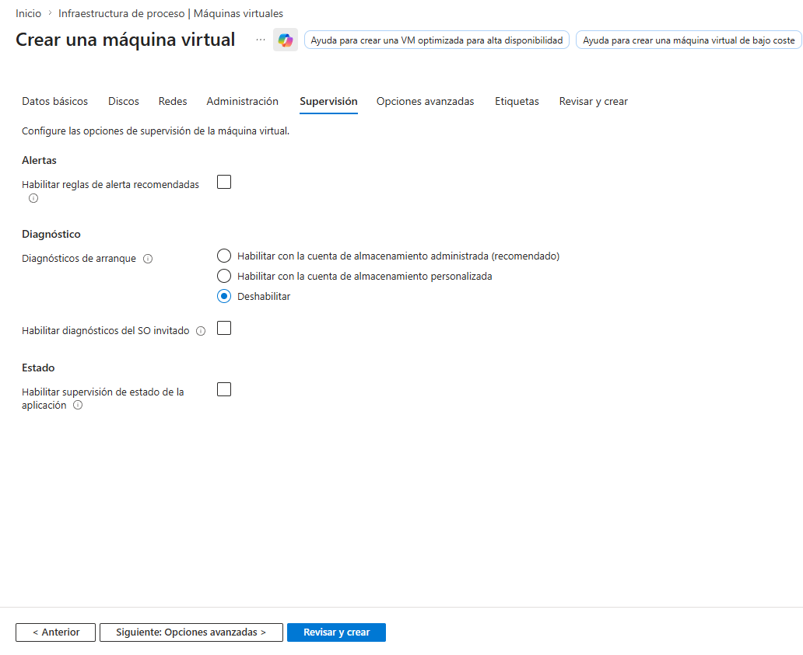
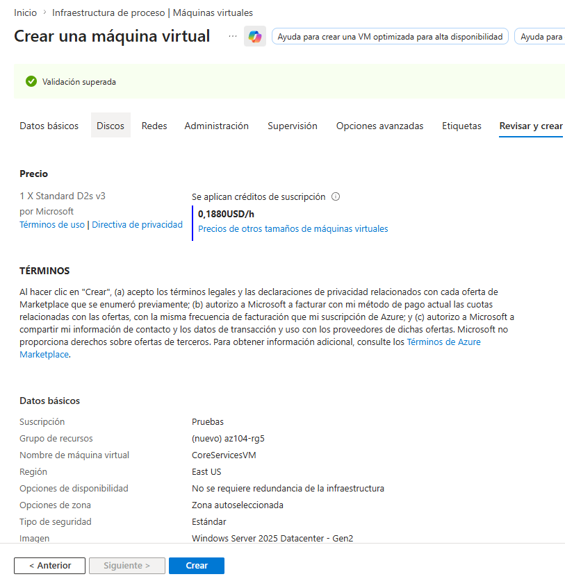
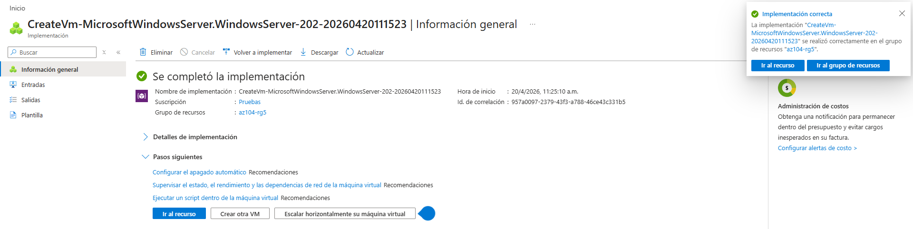

> 💡​ **No es necesario esperar a que los recursos se creen para continuar con la siguiente tarea.**

> 📝 **Nota:** *En esta tarea creamos la red virtual al mismo tiempo que la máquina virtual. También podríamos haber creado primero la infraestructura de red y luego agregar las máquinas virtuales, según el enfoque de diseño que queramos aplicar. Cualquiera de las alternativas es válida.*

---

### Tarea 2: Crear una máquina virtual en una red virtual diferente

En esta tarea, **creamos una red virtual de manufactura junto con una máquina virtual**.

1. Desde el **Azure Portal**, buscamos y navegamos a **Máquina Virtual**.
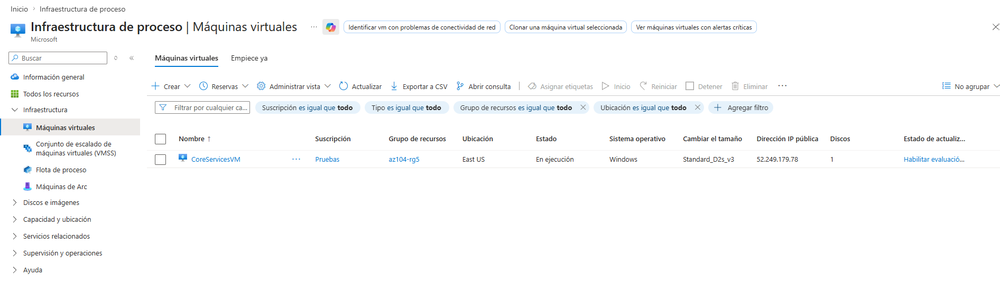
2. En la página de máquinas virtuales, seleccionamos **Crear** y luego **Máquina virtual**.
3. En la pestaña **Datos básicos**, completamos el formulario con la siguiente información y luego seleccionamos **Siguiente: Discos >**.  
   Para cualquier configuración no especificada, dejamos el valor predeterminado.  

| Configuración | Valor |
|---------------|-------|
| Suscripción | Nuestra suscripción |
| Grupo de recursos | **az104-rg5** |
| Nombre VM | **ManufacturingVM** |
| Región | **(US) East US** |
| Tipo de seguridad | **Standard** |
| AOpciones de disponibilidad | **No infrastructure redundancy required** |
| Imágen | **Windows Server 2025 Datacenter - x64 Gen2** |
| Tamaño | **Standard_D2s_v3** |
| Usuario | **localadmin** |
| Contraseña | Proporcionamos una contraseña compleja |
| Reglas de puerto de entrada | **None** |

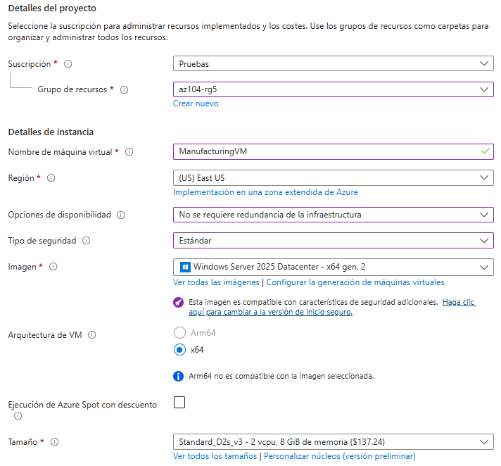
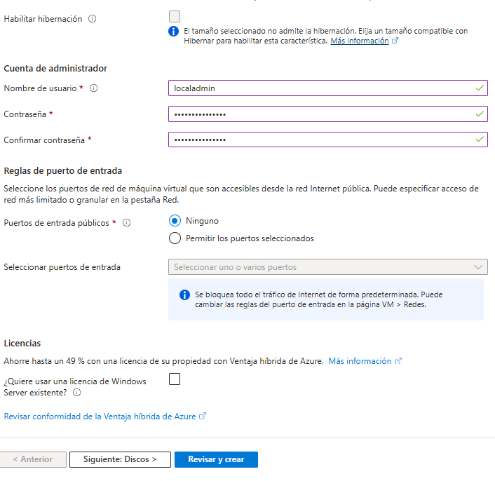

1. En la pestaña **Discos**, dejamos los valores predeterminados y seleccionamos **Siguiente: Redes >**.  
2. En la pestaña **Redes**, para **Red virtual**, seleccionamos **Crear nuevo**.  
3. Configuramos la red virtual con la siguiente información y luego seleccionamos **OK**.  
   Si es necesario, reemplazamos el rango de direcciones existente.  

| Configuración | Valor |
|---------------|-------|
| Name | **ManufacturingVnet** |
| Address range | **172.16.0.0/16** |
| Subnet Name | **Manufacturing** |
| Subnet address range | **172.16.0.0/24** |

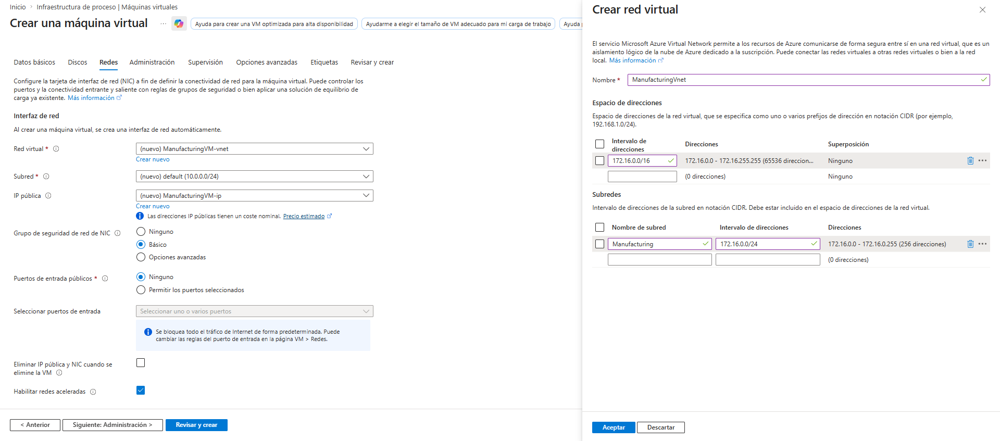

1. Seleccionamos la pestaña **Supervisión**. En **Diagnóstico de arranque**, elegimos **Deshabilitado**.
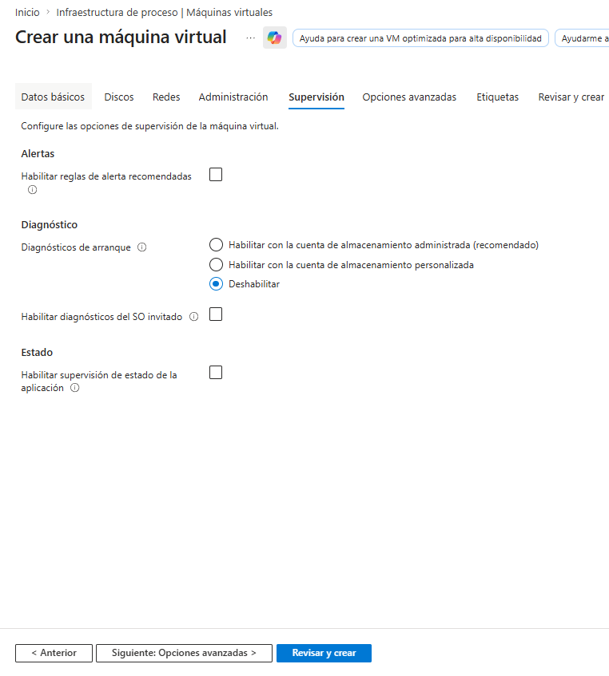

2. Seleccionamos **Revisar y crear**, y luego **Crear**.  
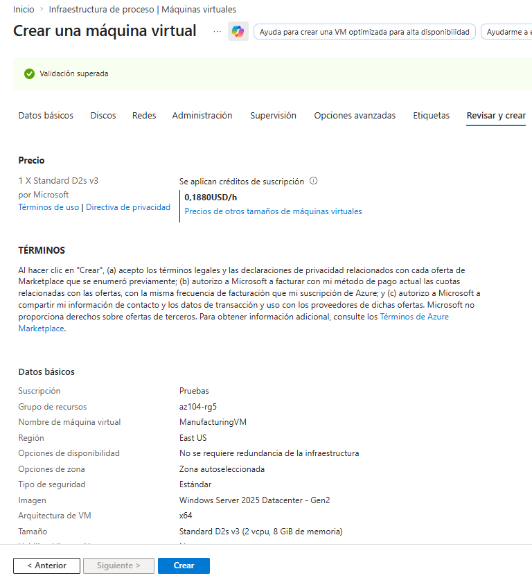
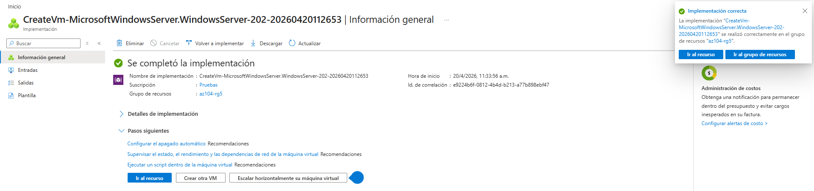

---

### Tarea 3: Usar Network Watcher para probar la conexión entre máquinas virtuales

En esta tarea, **verificamos que los recursos en redes virtuales con peering puedan comunicarse entre sí**.  
Para ello utilizamos **Network Watcher** como herramienta de diagnóstico de conexión.  
Antes de continuar, nos aseguramos de que ambas máquinas virtuales ya se han aprovisionado y se encuentran en ejecución.

1. Desde el **Azure Portal**, buscamos y seleccionamos **Network Watcher**.
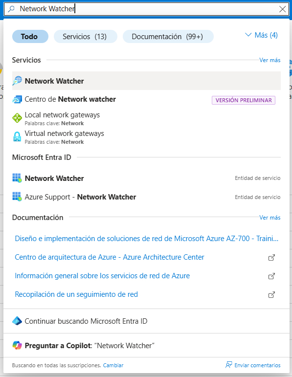
2. En el menú de herramientas de diagnóstico de red, seleccionamos **Solución de problemas de conexión**.
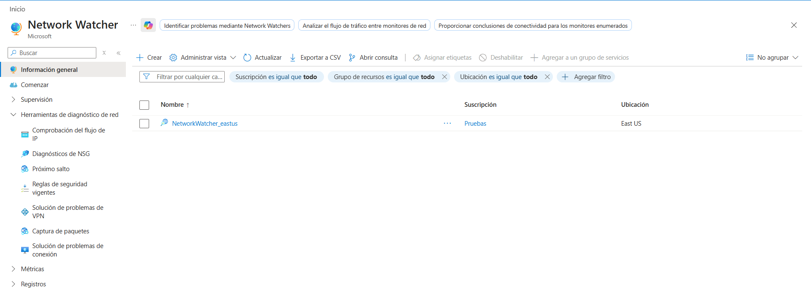
3. Completamos los campos en la página de *Solución de problemas de conexión* con la siguiente información:  

| Campo | Valor |
|-------|-------|
| Source type | **Virtual machine** |
| Virtual machine | **CoreServicesVM** |
| Destination type | **Select a virtual machine** |
| Virtual machine | **ManufacturingVM** |
| Preferred IP Version | **Both** |
| Protocol | **TCP** |
| Destination port | **3389** |
| Source port | (Dejamos en blanco) |
| Diagnostic tests | Valores predeterminados |

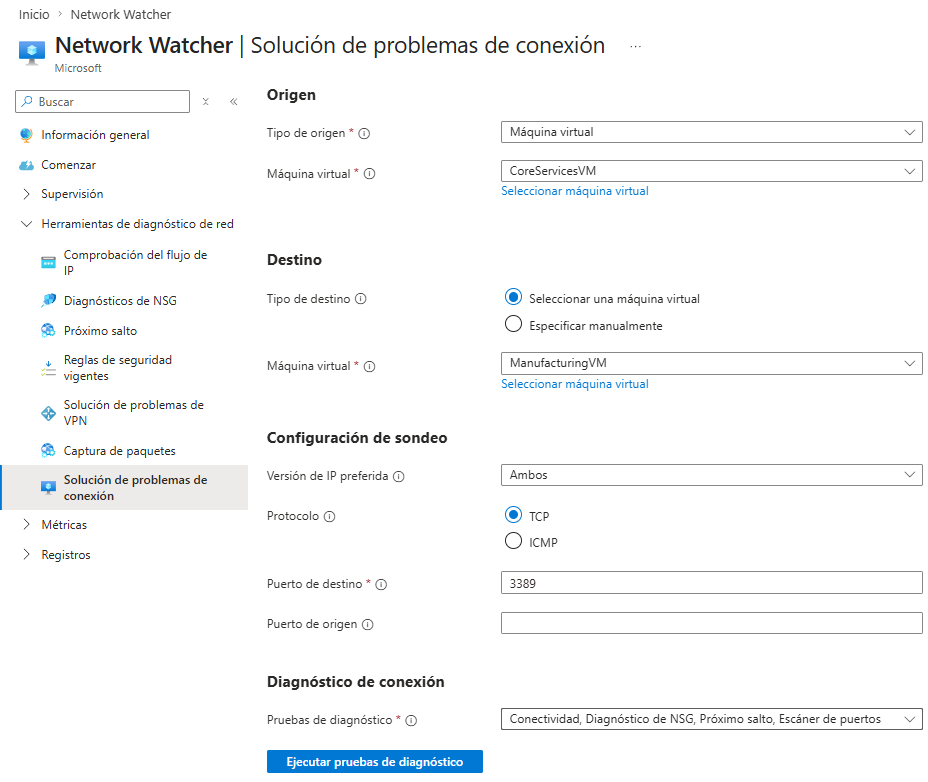

1. Seleccionamos **Ejecutar pruebas de diagnóstico**.

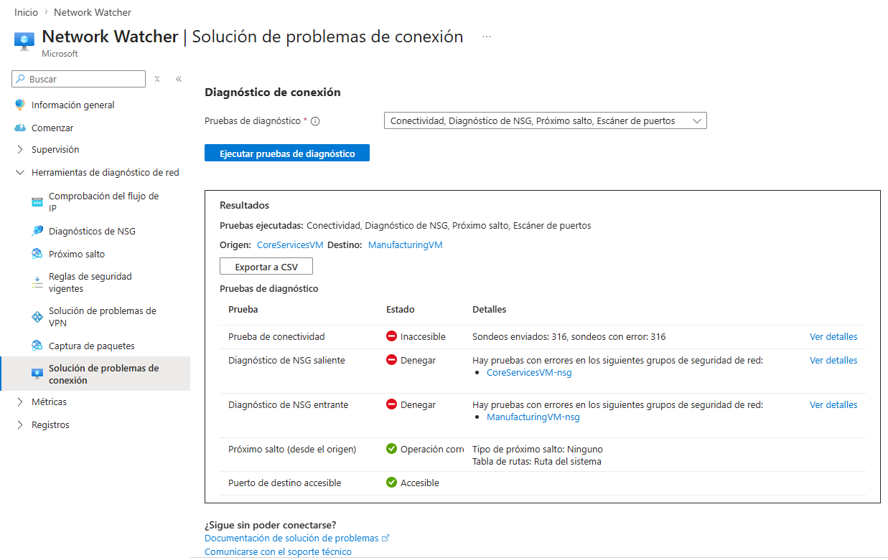

> ⏳ Nota: Puede tardar un par de minutos en devolver los resultados. Durante este tiempo, las opciones de la pantalla aparecerán deshabilitadas mientras se recopilan los datos.  
> Observaremos que la prueba de conectividad muestra **INACCESIBLE**. Esto es lógico, ya que las máquinas virtuales se encuentran en **redes virtuales diferentes** y aún no hemos configurado el peering entre ellas.

---

### Tarea 4: Configurar peering entre redes virtuales

En esta tarea, **creamos un peering de red virtual para habilitar la comunicación entre recursos en diferentes redes virtuales**.

1. En el **Azure Portal**, seleccionamos la red virtual **CoreServicesVnet**.
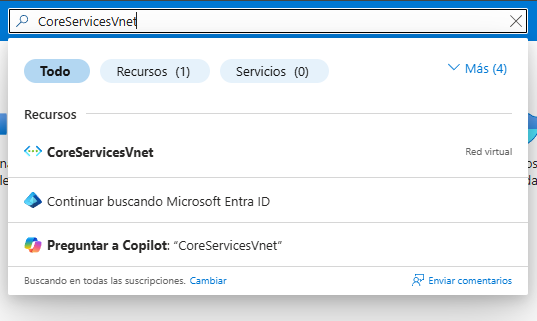
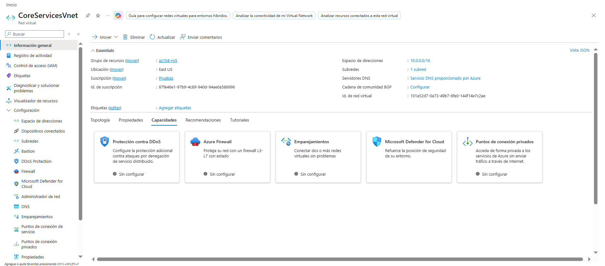
2. Dentro de **CoreServicesVnet**, en la sección **Configuración**, seleccionamos **Emparejamientos**.
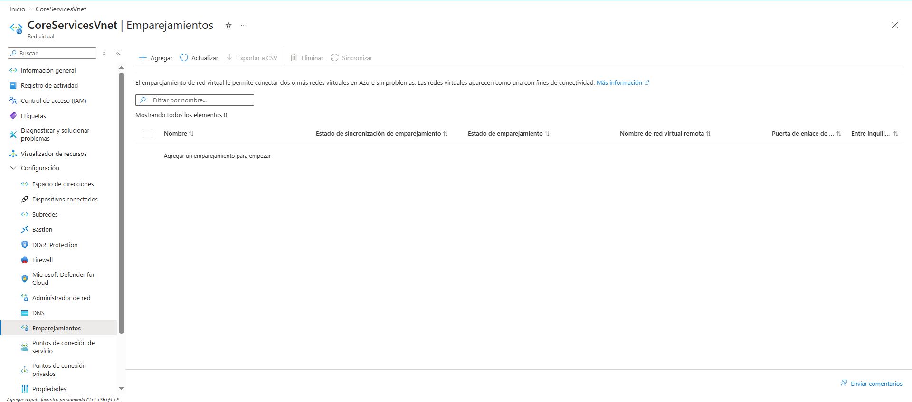
3. En la página de **Emaprejamiento**, seleccionamos **+ Agregar**.
   Si no se especifica algún parámetro, dejamos el valor predeterminado.  

Configuramos los parámetros de la siguiente manera:

| Parámetro | Valor |
|-----------|-------|
| Nombre del vínculo de emparejamiento | **ManufacturingVnet-to-CoreServicesVnet** |
| Red virtual | **ManufacturingVnet (az104-rg5)** |
| Permitir ‘CoreServicesVnet’ para acceder a ‘ManufacturingVnet’ | Seleccionado (predeterminado) |
| Permitir ‘CoreServicesVnet’ Para recibir el tráfico reenviado desde ‘ManufacturingVnet’ | Seleccionado |
| Peering link name | **CoreServicesVnet-to-ManufacturingVnet** |
| Permitir ‘ManufacturingVnet’ para acceder a ‘CoreServicesVnet’ | Seleccionado (predeterminado) |
| Permitir ‘ManufacturingVnet’ Para recibir el tráfico reenviado desde ‘CoreServicesVnet’ | Seleccionado |

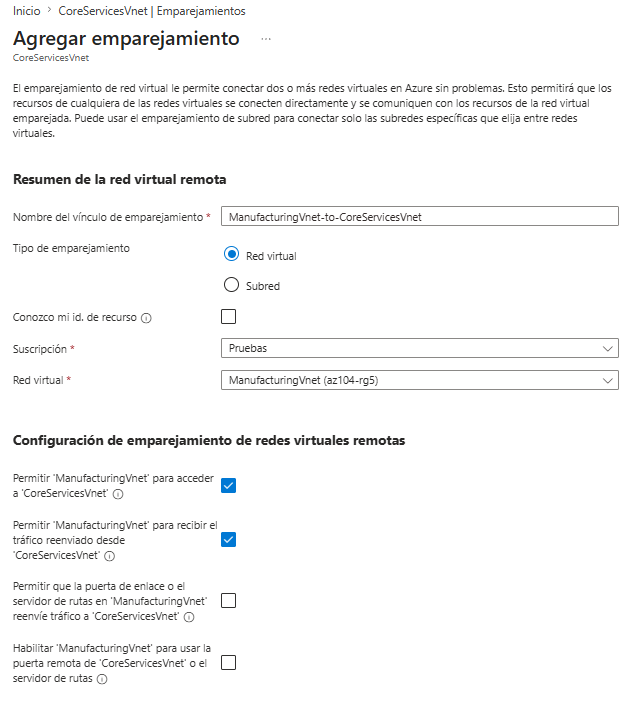
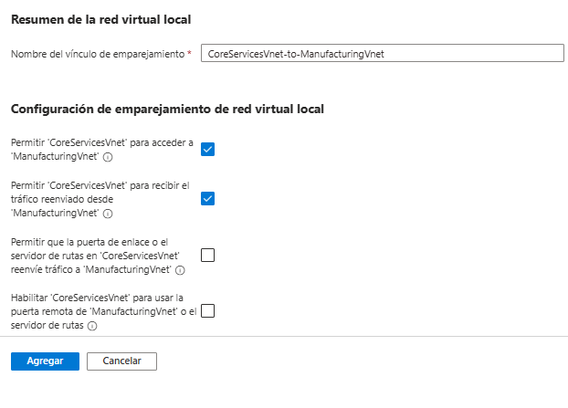

1. Hacemos clic en **Agregar**.

2. En **CoreServicesVnet**, dentro de **Emparejamientos**, verificamos que el peering **CoreServicesVnet-to-ManufacturingVnet** esté listado.  
   Refrescamos la página para asegurarnos de que el estado del peering sea **Connected**.
   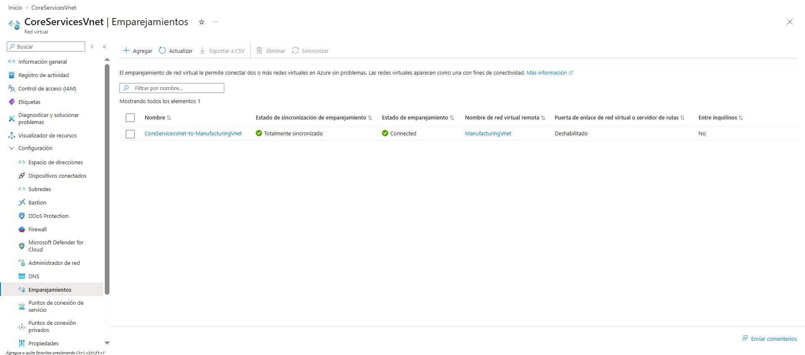
3. Cambiamos a la red virtual **ManufacturingVnet** y verificamos que el peering **ManufacturingVnet-to-CoreServicesVnet** esté listado.
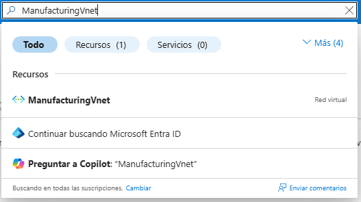
   Confirmamos que el estado del peering sea **Connected**.  
   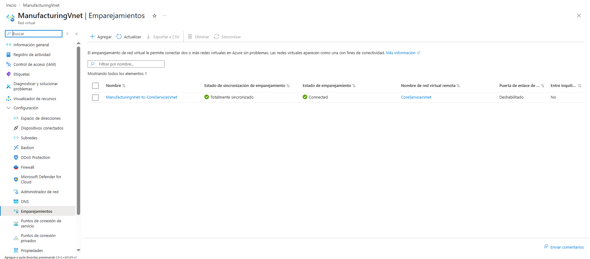
   Es posible que necesitemos refrescar la página.

En esta tarea hemos establecido el **peering bidireccional entre las redes virtuales CoreServicesVnet y ManufacturingVnet**, habilitando la comunicación segura entre ambas.

---

### Tarea 5: Usar Azure PowerShell para probar la conexión entre máquinas virtuales

En esta tarea, **volvemos a probar la conexión entre las máquinas virtuales en diferentes redes virtuales**, utilizando **Azure PowerShell**.

1. **Verificamos la dirección IP privada de la máquina virtual CoreServicesVM**:  
   - Desde el **Azure Portal**, buscamos y seleccionamos la máquina virtual **CoreServicesVM**.
   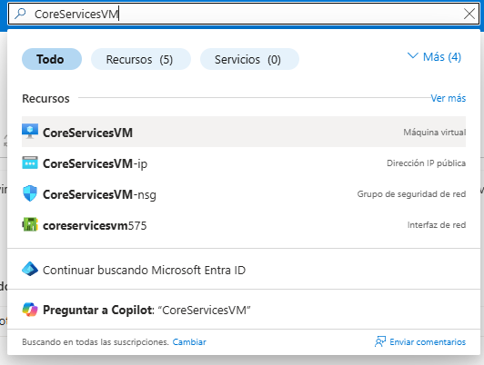
   - En la pestaña **Información General**, dentro de la sección **Redes**, anotamos la **dirección IP privada** de la máquina.
   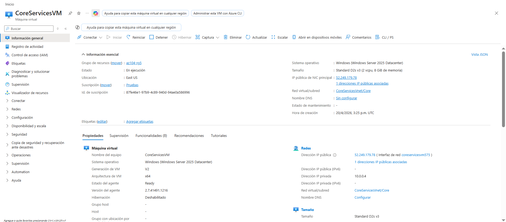
   - Esta información será necesaria para realizar la prueba de conexión.  

2. **Probamos la conexión hacia CoreServicesVM desde ManufacturingVM**:  
   - Cambiamos a la máquina virtual **ManufacturingVM**.
   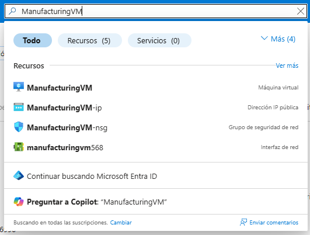
   - En la sección **Operaciones**, seleccionamos **Ejecutar comando**.
   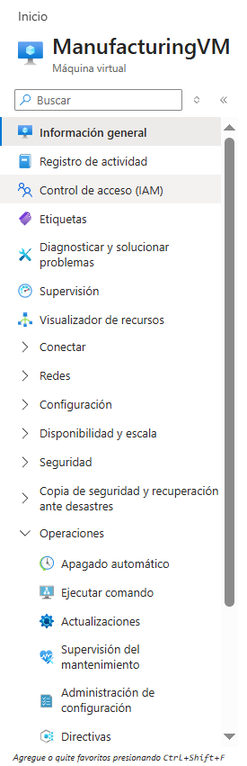
   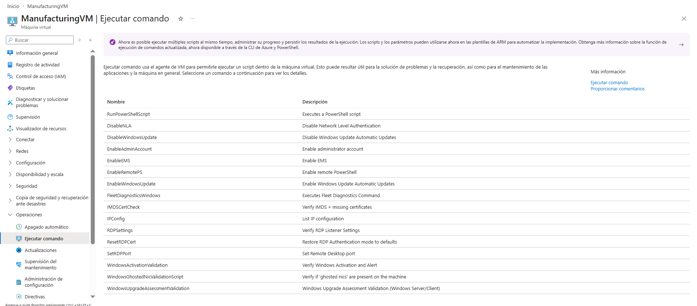
   - Elegimos **RunPowerShellScript** y ejecutamos el siguiente comando, asegurándonos de usar la dirección IP privada de **CoreServicesVM**:

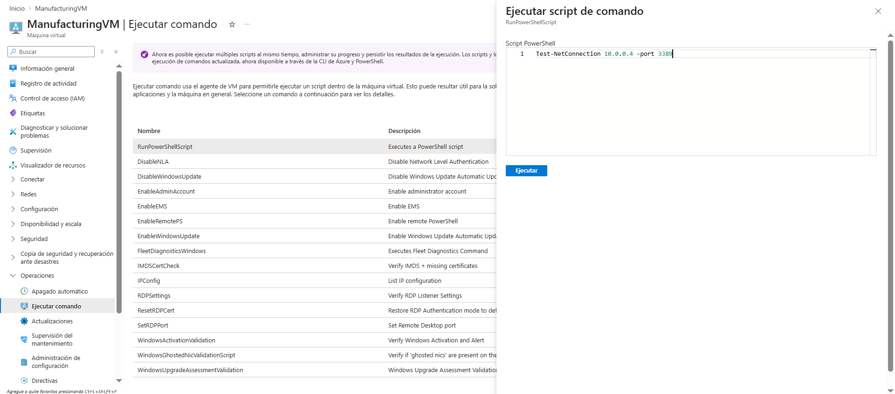

   ```powershell
   Test-NetConnection <Dirección IP privada de CoreServicesVM> -port 3389
   ```

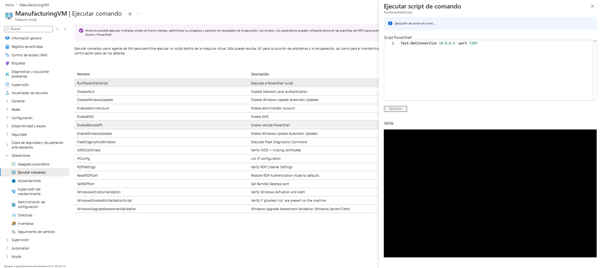

   > ⏳ Nota: Puede tardar un par de minutos en que el script se complete. En la parte superior de la página veremos el mensaje informativo **Ejecución de script en curso...** mientras se ejecuta.  

1. **Validamos el resultado de la prueba**:  
   - La conexión debería ser exitosa, ya que el **peering** entre las redes virtuales ha sido configurado.  
   - El nombre del equipo y la dirección remota que aparezcan en la ventana de PowerShell pueden variar según la configuración, pero el resultado debe indicar que la conexión fue establecida correctamente.  

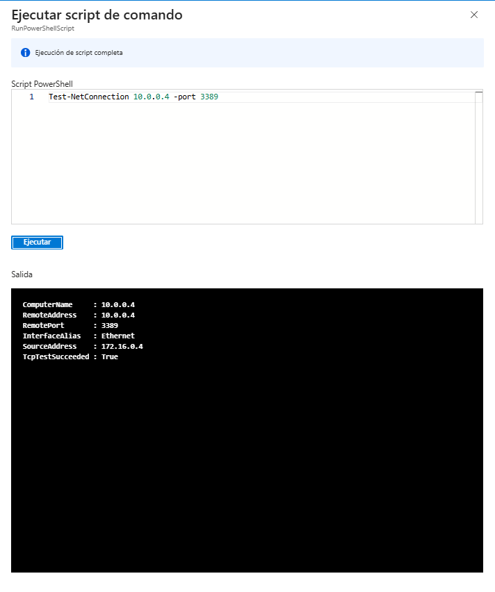

---

En esta tarea confirmamos que, gracias al **peering entre redes virtuales**, las máquinas virtuales pueden comunicarse de manera segura utilizando sus direcciones IP privadas.

---

### Tarea 6: Crear una ruta personalizada

En esta tarea, **controlamos el tráfico de red entre la subred de perímetro y la subred interna de servicios centrales**.  
Se instalará un **appliance de red virtual (NVA)** en la subred de perímetro y todo el tráfico deberá ser enrutado hacia allí.

1. En el **Azure Portal**, buscamos y seleccionamos la red virtual **CoreServicesVnet**.
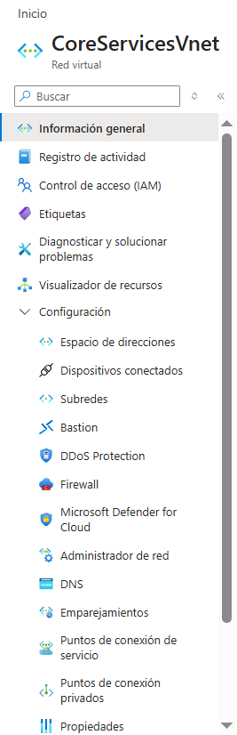
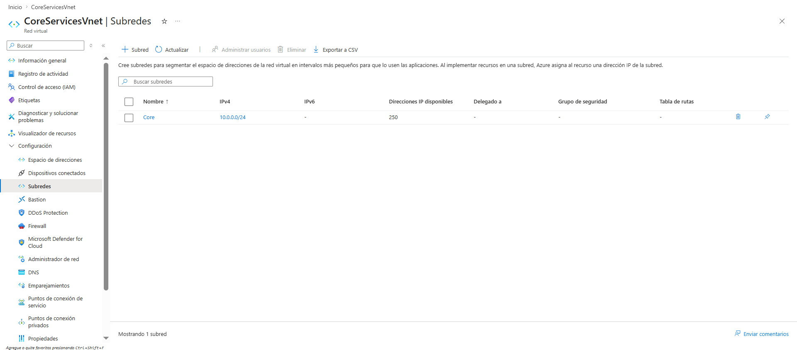

2. Seleccionamos **Subredes** y luego **+ Subred**.
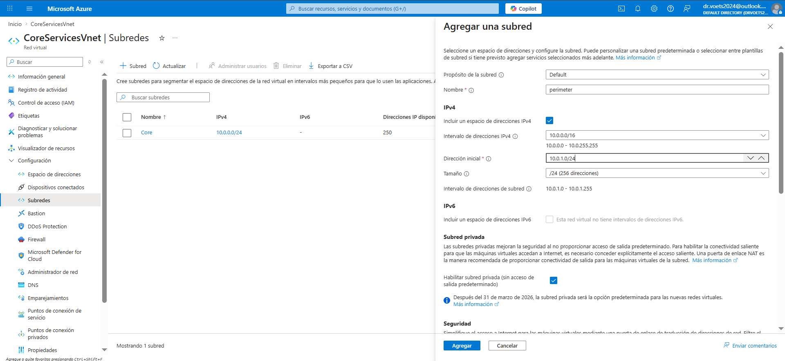
   Nos aseguramos de hacer clic en **Add** para guardar los cambios.  

| Configuración | Valor |
|---------------|-------|
| Name | **perimeter** |
| Starting address | **10.0.1.0/24** |

1. En el **Azure Portal**, buscamos y seleccionamos **Tablas de rutas**, luego seleccionamos **+ Crear**.
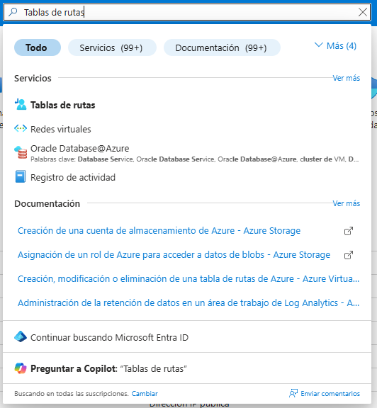
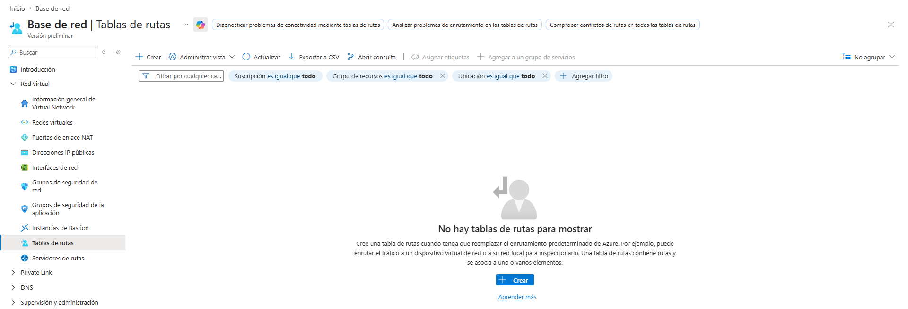

2. Ingresamos los siguientes detalles, seleccionamos **Revisar y crear**, y luego **Crear**.  

| Configuración | Valor |
|---------------|-------|
| Subscripción | Nuestra suscripción |
| Grupo de Recursos | **az104-rg5** |
| Región | **East US** |
| Nombre | **rt-CoreServices** |
| Propagar rutas de puertas de enlace | **No** |

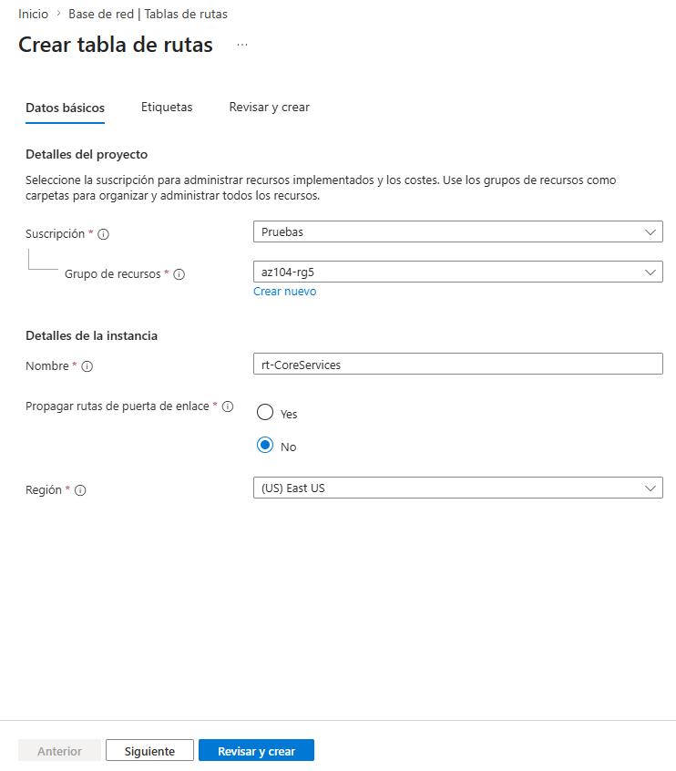
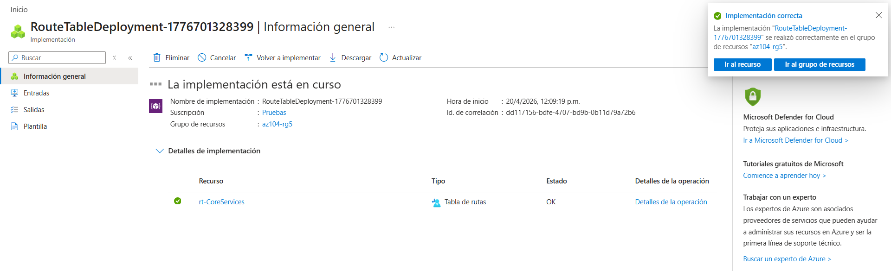

1. Una vez desplegada la tabla de rutas, buscamos y seleccionamos **Route Tables**.  
2. Seleccionamos el recurso (no la casilla) **rt-CoreServices**.
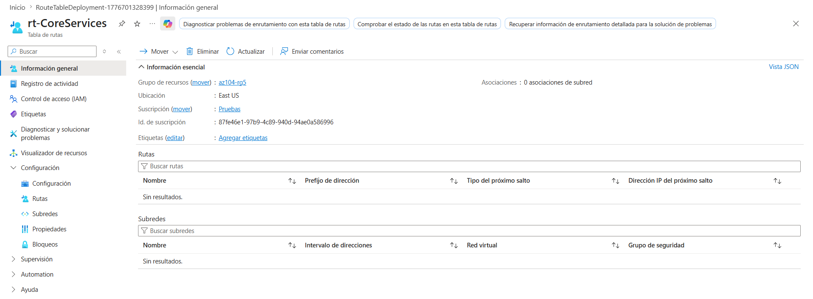

3. Expandimos **Configuración**, luego seleccionamos **Rutas** y después **+ Agregar**.
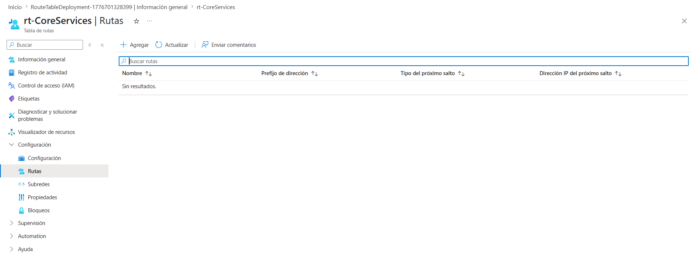

   Creamos una ruta desde un futuro **Network Virtual Appliance (NVA)** hacia la red virtual de servicios centrales.

| Configuración | Valor |
|---------------|-------|
| Route name | **PerimetertoCore** |
| Destination type | **IP Addresses** |
| Destination IP addresses | **10.0.0.0/16** (red virtual de servicios centrales) |
| Next hop type | **Dispositivo virtual** (Network Virtual Appliance) |
| Next hop address | **10.0.1.7** (futuro NVA) |

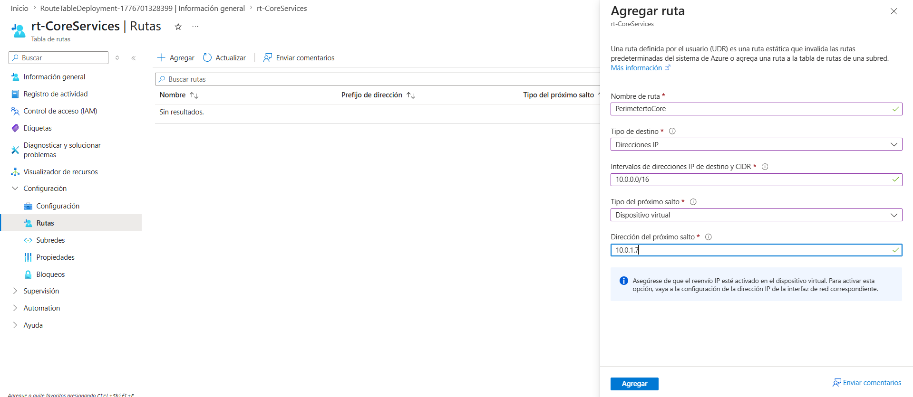

1. Seleccionamos **Add**.
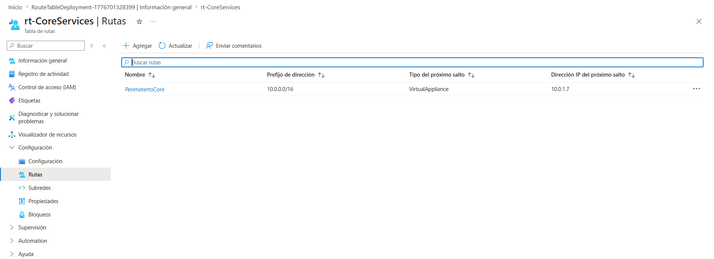

2. Finalmente, asociamos la ruta con la subred:  
   - Seleccionamos **Subnets** y luego **+ Associate**.
   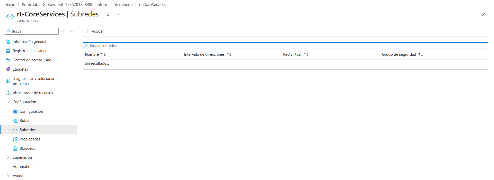
   - Completamos la configuración con la siguiente información:  

| Configuración | Valor |
|---------------|-------|
| Virtual network | **CoreServicesVnet (az104-rg5)** |
| Subnet | **Perimeter** |

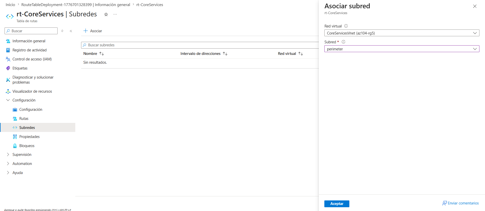

---

> 📝 **Nota:** Hemos creado una **ruta definida por el usuario (UDR)** para dirigir el tráfico desde la DMZ hacia el nuevo **NVA**, controlando así el flujo de comunicación entre el perímetro y los servicios centrales.

---

## Resultado final

Al finalizar el laboratorio, contamos con un entorno interconectado mediante peering local y global, con rutas personalizadas que permiten controlar el flujo de tráfico. Este escenario refleja cómo Azure facilita la conectividad entre sitios y regiones.

---

## Puntos clave

- De forma predeterminada, los recursos en diferentes redes virtuales **no pueden comunicarse**.  
- El *Virtual Network Peering* permite conectar de manera transparente dos o más redes virtuales en Azure.  
- Las redes virtuales con peering se comportan como una sola a efectos de conectividad.  
- El tráfico entre máquinas virtuales en redes virtuales con peering utiliza la **infraestructura troncal de Microsoft**.  
- Las rutas definidas por el sistema se crean automáticamente para cada subred en una red virtual.  
  Las rutas definidas por el usuario pueden **sobrescribir o complementar** las rutas predeterminadas.  
- **Azure Network Watcher** proporciona un conjunto de herramientas para monitorear, diagnosticar y visualizar métricas y registros de los recursos IaaS de Azure.

---

## Eliminación de Recursos

Si estamos trabajando con nuestra propia suscripción, es importante tomar un momento para **eliminar los recursos del laboratorio**.  
Esto asegura que los recursos se liberen y que los costos se minimicen.  
La forma más sencilla de hacerlo es eliminar directamente el **grupo de recursos** del laboratorio.

### Azure Portal

1. Iniciamos sesión en el **Azure Portal**.  
2. Seleccionamos el **grupo de recursos** creado para el laboratorio.  
3. Seleccionamos **Eliminar el grupo de recursos**.  
4. Ingresamos el nombre del grupo de recursos.  
5. Hacemos clic en **Eliminar**.  

### Azure PowerShell

```powershell
Remove-AzResourceGroup -Name resourceGroupName
```

### Azure CLI

```powershell
az group delete --name resourceGroupName
```

---

## Contribuciones

Este README fue adaptado y traducido al español para fines de estudio del examen AZ-104. Puede ser enriquecido con diagramas adicionales, ejemplos de comandos en PowerShell/CLI y notas de buenas prácticas. Se agradecen contribuciones que mejoren la claridad y accesibilidad del contenido.

---

## Licencia

Este laboratorio se basa en materiales oficiales de Microsoft Learning Labs para AZ-104. Uso educativo y de práctica.
